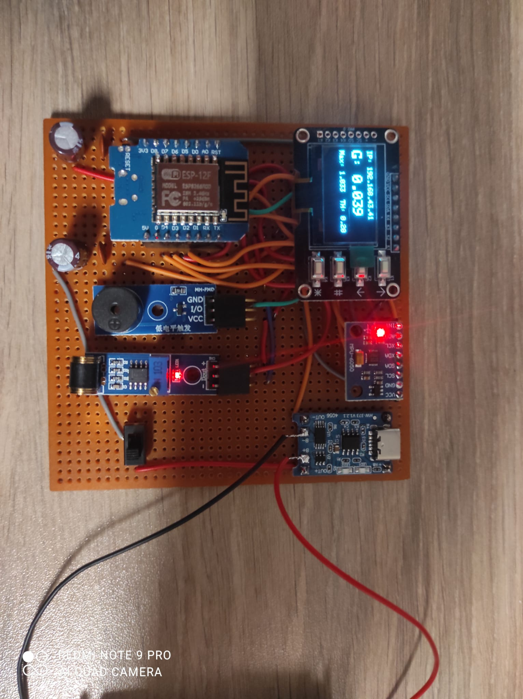
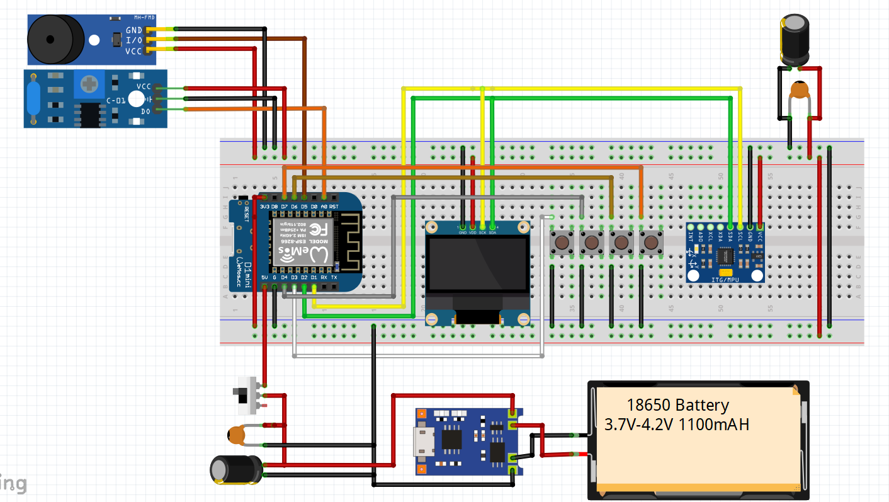
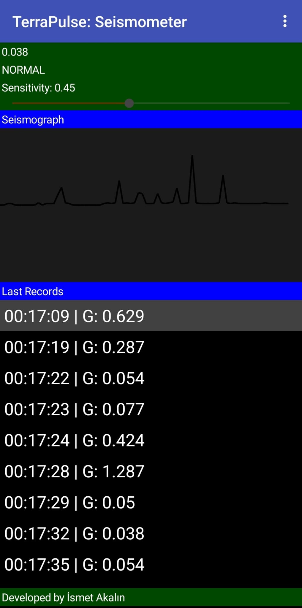
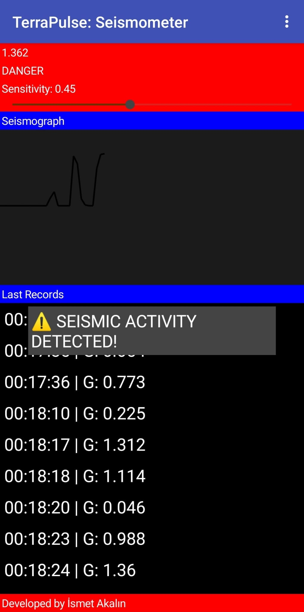
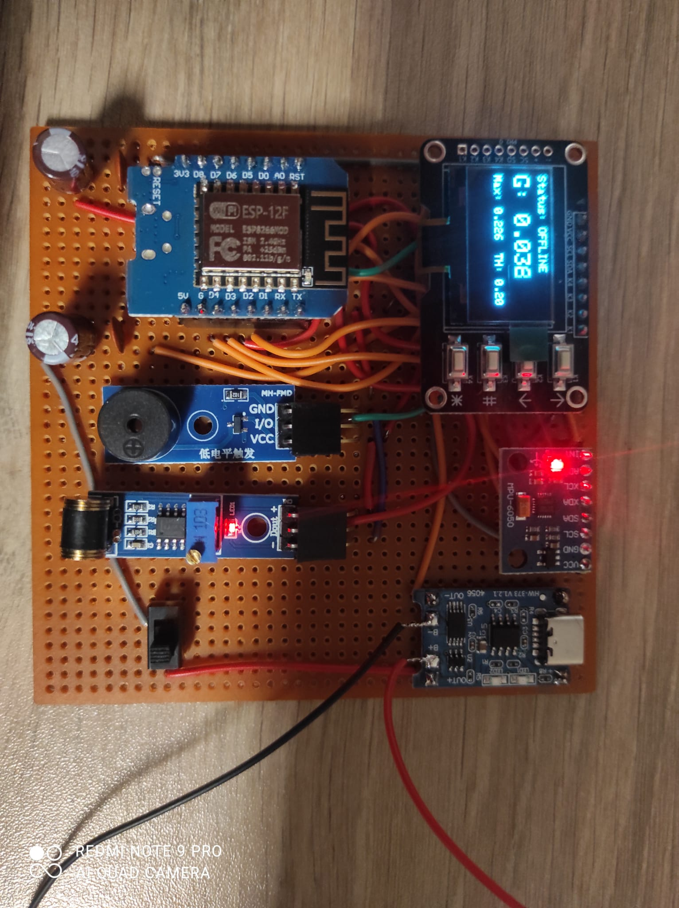

# 🌍 TerraPulse: IoT-Based Seismic Monitoring & Warning System

**TerraPulse** is an open-source, high-precision seismic activity monitoring system designed with **Wemos D1 Mini (ESP8266)**. It measures real-time gravitational forces (G-force), detects vibrations, and provides both local visual/auditory alerts and remote mobile monitoring.



## 🚀 Key Features
* **Dual-Mode Operation:** Works in **IoT Mode** (WiFi connected) for remote monitoring and **Standalone Mode** (Offline) for independent safety.
* **Real-Time Data Visualization:** Live G-force monitoring via OLED display and a custom-built Mobile App.
* **Advanced Control:** 4-button physical interface on the device to adjust sensitivity, reset peak values, and manage power (Screen Toggle).
* **Failsafe Alarm System:** Active Low buzzer integration for instant auditory warnings during "DANGER" levels.

---

## 🛠️ Hardware & Schematics
The system is built on a robust mechatronic foundation, ensuring signal stability with decoupling capacitors.



* **Microcontroller:** Wemos D1 Mini (ESP8266)
* **IMU Sensor:** MPU6050 (Accelerometer & Gyroscope)
* **Vibration Sensor:** 801S High Sensitivity Module
* **Display:** 0.96" SSD1306 OLED (I2C)
* **Alert:** Active Low Buzzer Module
* **Power:** 18650 Li-ion Battery + TP4056 Charger
* **Filtering:** 100nF/470uF Bulk & Decoupling capacitors.

---

## 📱 Mobile App (TerraPulse Mobile)
Developed using **MIT App Inventor**, the mobile application communicates with the device via an HTTP Web Server.

| Normal Mode | Alarm Mode |
| :---: | :---: |
|  |  |

* **Live Sismograf:** Visualizes the pulse of the earth.
* **Dynamic Threshold:** Adjust device sensitivity remotely using a slider.
* **Status Logs:** Real-time "NORMAL" vs "DANGER" status updates.

---

## 📂 Project Structure
```text
├── src/
│   ├── Terrapulse_source_code.ino    # Main firmware
│   └── i2c_device_finding_code.ino  # Debug tool for I2C addresses
├── mobile/
│   ├── Terra_Pulse_Mobile_App.aia   # App Inventor source file
│   └── Terra_Pulse.apk              # Ready-to-install Android app
├── hardware/
│   ├── Terra_Pulse_Schematic.fzz    # Fritzing schematic file
│   └── Terrapulse_schematics.png    # High-res circuit diagram
└── assets/                          # Screenshots & UI icons
    ├── Terrapulse_online_mode.jpeg
    ├── Terrapulse_offline_mode.jpeg
    ├── Terrapulse_normal_mode_mobile.jpeg
    ├── Terrapulse_alarm_mode_mobile.jpeg
    └── Terrapulse_schematics.png
```

---

## ⚙️ Installation & Usage
1.  **Hardware:** Assemble the circuit as shown in `hardware/Terrapulse_schematics.png`.
2.  **Firmware:** * Open `src/Terrapulse_source_code.ino` in Arduino IDE.
    * Enter your WiFi credentials.
    * Upload to Wemos D1 Mini.
3.  **Mobile App:** Install `mobile/Terra_Pulse.apk` on your Android device. Enter the IP address displayed on the OLED (see below) into the app.



---

## 👨‍💻 Developed By
**İsmet Akalın** *3rd-year Mechatronics Engineering Student at Izmir Katip Celebi University* *Embedded Systems & Robotics Enthusiast*

---

### 📝 License
This project is licensed under the **MIT License**.
